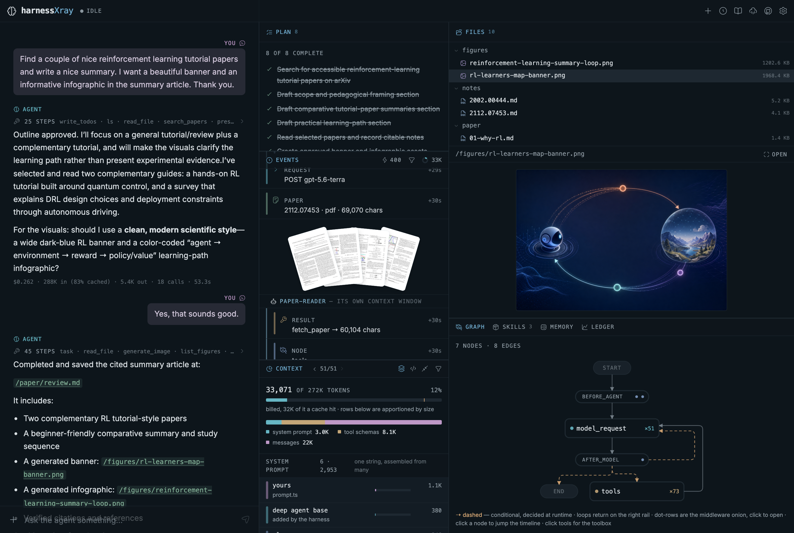

# harnessXray

**A lab for seeing how an AI agent actually works.**

Most agent frameworks are a black box with a chat window bolted to the front. You
type, something happens, text comes back. What was in the prompt? Which of those
tools did you write? Where did the model's memory go? How much of that bill was
re-sending the same conversation for the fifth time?

harnessXray runs a real [Deep Agents](https://docs.langchain.com/oss/javascript/deepagents/overview)
harness — planning, tools, virtual filesystem, memory, subagents, skills,
human-in-the-loop — entirely in your browser, and takes it apart while it runs.

**[Open the live lab →](https://neovand.github.io/harnessXray/)** No install; a
bundled recording replays the whole harness with no key and no network.



The left column is a working agent that searches arXiv, reads papers and writes
a cited, illustrated review. Everything to its right is the dissection: the plan
it maintains, every event as it happens, the context window taken apart, the
filesystem it writes, and the graph it runs on.

<br>

## Start here

Open the [live lab](https://neovand.github.io/harnessXray/) and click **“or
replay the bundled demo — no key needed”** on the empty state. It runs a full
recorded session: the harness really executes, and only its network calls answer
from the recording. Three things worth doing on the first visit:

1. **Watch the context fill.** The gauge on the context bar is the live request.
   Open the panel under it and every row — system prompt, each tool schema, each
   message — is a real cost, apportioned from the tokens the provider billed.
2. **Find a subagent.** On the events timeline they run in their own indented
   lane. Everything in that lane was paid for once, inside a context window that
   was then thrown away; only the small reply came back to the parent.
3. **Open the book.** The `⌐` button in the header docks a ten-chapter field
   guide, and every chapter ends by pointing at the panel where that idea is
   happening on screen right now.

Then, if you want to run it for real, click the gear and paste an OpenAI key. It
is held in your browser and sent only to `api.openai.com`.

<br>

## The one design rule

**The agent is unmodified and unaware it is observed.** Nothing is passed _into_
the harness to make the X-ray work.

Everything you see is read from what LangGraph already publishes — `messages` for
token and tool-call deltas, `updates` for each node's committed state — plus the
literal bytes, captured by tee'ing the `fetch` the OpenAI SDK was given. That is
why the todo list, the virtual filesystem and the harness's own summarization all
appear without the agent cooperating.

This constraint is the whole pedagogy. A diagram of what _should_ happen teaches
much less than a readout of what did.

<br>

## What you can see

**Events** — every event in the run, filterable by kind, with subagent lanes
indented under the parent. Click a row and its payload unfolds in place, either
decomposed or as the raw SSE frames exactly as they arrived.

**Context** — the outgoing request, taken apart. The assembled system prompt is
split back into the bands each middleware contributed (yours, the base prompt,
plan, filesystem, subagents, skills, memory), every tool schema is itemised, and
every row's cost is apportioned from the tokens the provider actually billed,
with the cached prefix shaded in. A pager walks call by call; a raw view shows
the request whole.

**Plan** — `write_todos` as the agent maintains it, turn over turn.

**Files** — the agent's virtual filesystem, which is really a checkpointed state
channel, with a glance preview and a docked reader for actually reading it:
markdown with maths and real figures, PDFs page by page.

**Graph** — the compiled LangGraph topology, read from the run rather than drawn
from hope. Run counts on every node, conditional edges dashed, the middleware
onion collapsed into dot-rows you can open. Click a node to jump the timeline;
click `tools` for every tool the agent is actually carrying.

**Skills** — which skills are _loaded_ versus actually _read_. The gap between
those two numbers is the entire argument for progressive disclosure.

**Memory** — the long-term store, sitting next to a filesystem that outlives the
turn but not the thread, so the difference in lifetime is visible rather than
asserted.

**Ledger** — what each turn cost, how long it took, and how much of the input
was a cache hit.

<br>

## The lab teaches

**The book.** The `⌐` button docks a ten-chapter illustrated field guide. Each
chapter is one plate, one schematic and a few short sections — no code required —
and each ends by pointing at the live panel where that idea is happening right
now. The curriculum, in order:

1. **What a harness is** — an agent is a loop around an ordinary model, and the
   code running that loop owns everything you think of as the agent.
2. **A filesystem with no disk** — files as a checkpointed state channel, and why
   that beats a real disk.
3. **The model asks, the harness does** — what a tool actually is, and what every
   schema costs on every single request.
4. **A to-do list the harness owns** — the plan as state, and the last-write-wins
   edge that makes agents look forgetful.
5. **Subagents spend their own context** — pay tens of thousands of tokens once,
   in a window you then throw away.
6. **Skills are files** — progressive disclosure, and the arithmetic that makes
   twenty skills nearly free.
7. **Memory has two lifetimes** — the checkpointer and the store, and why mixing
   them up hurts.
8. **The middleware onion** — the mechanism behind almost everything above.
9. **Gates: stopping to ask a human** — how an interrupt really works, and why
   gating reads is worse than not gating at all.
10. **Building your own** — the assembly call, and the judgement that transfers.

**Explain mode.** The `+` menu reroutes the composer to the lab itself: ask how
the run worked and a tutor answers from a digest of the actual event log, in
streamed tokens, beside suggestion chips derived from the same events — the tool
the run leaned on, the middleware that fired, the gate that paused it. Every
timeline event also carries its own _explain_ button.

**A voice of its own.** Chats name themselves after the first exchange. These
sidecar calls deliberately do NOT go through the instrumented fetch — the X-ray
shows the specimen's traffic, and the microscope's own light must not appear on
the slide. The price of that honesty: sidecar spend (a few hundred `luna` tokens
per call) is invisible in-app, and is documented here instead.

**Four skies.** Midnight, rainy, cloudy and sunny themes, each retinting the
instruments — the event palette included — not just the wallpaper.

<br>

## Things worth playing with

**Skills.** A skill is one markdown file at `/skills/<name>/SKILL.md` in the
agent's own filesystem. The prompt carries only names and descriptions; the agent
opens one with an ordinary `read_file` when it decides the skill applies — and
the timeline names that moment as a `skill` row. Write your own, or have the
agent write one.

**Human-in-the-loop.** Image generation and the outline both pause for approval
before anything is spent. Approve, reject with a reason, or edit the tool call
the model proposed — before it runs.

**Compaction.** Watch the context fill, then fold it. The summary replaces the
older half _for the model_ while the transcript stays whole for you, and the
original messages are archived to `/conversation_history/`.

**Rewind.** Edit any earlier message and re-run from there. This forks the thread
at the checkpoint that turn started from — the turns that followed are not
deleted, they become an orphan branch the checkpointer still holds.

**Citations that refuse.** Every paper that enters the run through
`search_papers` or `fetch_paper` lands in a source registry, and the `cite`
tool refuses anything else — including papers only ever seen as a search
snippet. The `critic` subagent then checks the finished draft against the
notes before anything ships. Hallucinated references stop being a prompt
admonition and become a structural impossibility.

**Real figures.** `extract_figures` lifts the actual figures (and their actual
captions) out of a paper's HTML edition, so a review can show what the paper
reported instead of describing it. Generated art stays for banners.

**Record & replay.** Every run is already a recording — the wire plane holds
the literal bytes. Settings can export a thread as a fixture and load one
back; in replay the harness runs for real and only the _network_ answers from
the recording, so the whole app works with no key, no wifi, and no spend. A
bundled demo plays from the empty state — on the live site too.

<br>

## Running it

There is no server. Your OpenAI key is held in your browser and sent only to
`api.openai.com`.

Node 22 or newer (that is what CI builds with):

```sh
npm install
npm run dev
```

Open the app, click the gear, paste a key. For development you can instead put it
in a gitignored `.env`:

```sh
echo 'VITE_OPENAI_API_KEY=sk-...' > .env
```

That path is read only through `import.meta.env.DEV`, so it constant-folds out of
a production build.

```sh
npm run check       # svelte-check
npm run lint        # prettier + eslint
npm run test:unit   # vitest — pure logic in node, storage/replay in real chromium
npm run build       # static output, adapter-static
```

Every push to `master` deploys to GitHub Pages via
[`deploy.yml`](.github/workflows/deploy.yml) — the build runs with `BASE_PATH`
set to the repository name, and everything that touches an asset path goes
through SvelteKit's `base` so the same build works at the domain root too.

<br>

## How it is put together

| Path                       | What lives there                                                                           |
| -------------------------- | ------------------------------------------------------------------------------------------ |
| `src/lib/agent/`           | The agent itself — tools, subagents, skills, retrieval, compaction, persistence.           |
| `src/lib/xray/`            | The observation layer — event bus, wire capture, context reconstruction, usage accounting. |
| `src/lib/lab/`             | The lab's own voice — the tutor, the sidecar, the digest it teaches from, record/replay.   |
| `src/lib/book/`            | The ten illustrated chapters.                                                              |
| `src/lib/components/xray/` | The panels.                                                                                |
| `src/lib/components/chat/` | The app half.                                                                              |
| `docs/PLAN.md`             | The build plan, with what was proven and when.                                             |

A few decisions that are load-bearing rather than incidental, and are commented
where they live:

- **Wire capture** hooks `configuration.fetch` on `ChatOpenAI` rather than
  patching `window.fetch`, which would also swallow the arXiv and OpenAlex
  traffic and make the capture impossible to reason about.
- **The event log** is a plain array with a single reactive version counter. A
  run emits thousands of frames; proxying each one would cost more than rendering
  them.
- **Binary assets** live in IndexedDB addressed by path, not in the graph state —
  a 1024×1024 PNG is ~950KB of base64, and state is serialized into every
  checkpoint.
- **`AsyncLocalStorage`** does not exist in a browser, and LangGraph's
  `interrupt()` reads its config from one. The shim deliberately never unwinds.
- **`globalThis.process`** gets a four-field stub in `app.html`, because
  LangChain's dependency stack probes it in ways a compile-time define cannot
  reach — dev worked by accident and production did not, which is exactly the
  kind of bug a browser-only harness exists to make visible.

<br>

## Built by

[Neo Mohsenvand](https://github.com/NeoVand) · [LinkedIn](https://www.linkedin.com/in/mohsenvand/)

<br>

## License

[MIT](LICENSE). Use it, teach from it, take it apart.

One carve-out: `.agents/skills/` is vendored, not written here — seventeen
authoring skills pulled from `langchain-ai/langchain-skills`, `openai/skills`
and `huntabyte/shadcn-svelte`, each recorded with its source and content hash in
[`skills-lock.json`](skills-lock.json). They are development aids for working on
this repository, they ship in no build, and they stay under their own upstream
terms. The MIT grant covers the rest.
